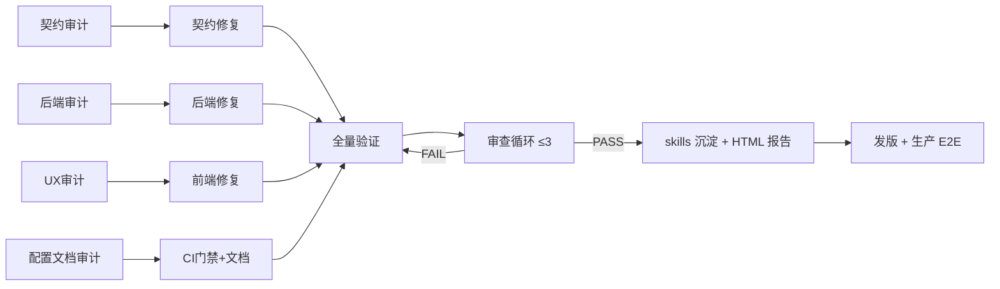

# 005-v77-terminal-closure Plan — 实施计划

## 需求追踪矩阵（用户上下文 → 落点）

### 显式需求

| # | 用户原话（拆解） | 落点 | 状态 |
|---|----------------|------|------|
| E1 | "在动代码之前创建结构化规范、spec kit 技能" | .specify/specs/005-*/spec.md（本地 spec-kit-skill 技能已加载） | ✅ |
| E2 | "addyosmani/agent-skills 技能" | critical-code-reviewer 协议（FR-D2），审查线程执行 | ✅ 协议纳入 |
| E3 | "全面审查全面查漏补缺，不局限前后端衔接、功能完整性闭环完美性" | FR-A1~A4 四路审计 + FR-B 修复 | 🔄 |
| E4 | "拆分需求每个细节、逐步披露指示" | 本矩阵显式/隐式/验收/非功能四层拆解 | ✅ |
| E5 | "多 agent 工作流，每 agent 一个子任务节点，节点链路测验验收" | 4 审计代理并行 + 主线程修复 + 独立审查代理复验 | 🔄 |
| E6 | "生成 workflow_status.md 并循环直至全部真实落地闭环" | workflow_status.md（已建骨架，循环更新） | 🔄 |
| E7 | "节点验收：单测/覆盖率/mock/E2E/UI/UX 签收按真实上下文" | tasks.md 每节点验证口径 | ✅ 计划 |
| E8 | "HTML 报告含上下文直觉变更+底部测验必须通过" | FR-C5 | ⏳ |
| E9 | "项目整理成 workflow 和 skills 复用（新 API/新功能标准路径）" | FR-C4：imagefree-workflow skill 扩 2 篇 SOP | ⏳ |
| E10 | "md 文档和记忆规则先读再判断过时→更新→查码→编码→验收" | FR-C3：verification-log 勿重跑 + MEMORY.md 更新 | ⏳ |
| E11 | "critical-code-reviewer 零容忍审查（有罪推定）" | FR-D2 协议全文已纳入审查线程提示词 | ✅ |
| E12 | "一人顶团队：多子代理+工具+技能+联网+多验证" | 本轮 4+1 代理编排 | ✅ |
| E13 | "Agent 管理 Agent：自主挑高价值增强（并发/安全/性能/UI）" | P3 增强清单 + architecture-evolution.md ADR | ⏳ |
| E14 | "验证记录表：下次优先读，标注改过的地方，避免盲目重复优化" | FR-C3 勿重跑机制（已有，本轮扩充） | ⏳ |
| E15 | "SOP 搞清楚，交接不迷茫" | FR-B5 SOP v2.4 | ⏳ |
| E16 | "发版上线：提交→推送→tag→Deploy→生产验证" | AC-10 | ⏳ |
| E17 | "禁止烧钱真实调用（图片/视频生成 API 免 E2E）" | NFR-3 + 付费红线 | ✅ 常驻 |
| E18 | "禁止空话伪实现" | NFR-5 四级标签 + 宪法 Complete Closure | ✅ 常驻 |

### 隐式需求（推导）

| # | 推导 | 落点 |
|---|------|------|
| I1 | 可调用：新环境按 README 一次跑通 | FR-A4 #3 README 复核 |
| I2 | 契约稳定：/v1/* 公益开放不改既有字段语义 | NFR-1 |
| I3 | 前端 bundle 不显著回退 | NFR-2（build 体积对比） |
| I4 | 回归防护：改前后必跑定向测试 | tasks.md 每节点 |
| I5 | 交接资产：ADR 记录"为何不用 Redis/Kafka" | FR-C4 + architecture-evolution.md |

### 非功能要求

兼容性（NFR-1）/ 性能（NFR-2）/ 安全（NFR-3）/ 平台双栈（NFR-4）/ 诚实（NFR-5）→ 见 spec NFR 区。

## 架构与依赖

## 设计约束

- 修复优先"最少副作用"：能加字段不删字段，能加注不重构，能局部不全局。
- 前端修复统一走既有模式（useApi/adminHeaders/tf-* 类），不引入新状态库。
- 测试策略：每修复配最小定向测试；收尾全量（后端 CI 口径 + vitest + 双 E2E）。
- 复用：先查 verification-log 勿重跑区，再动手验证。
